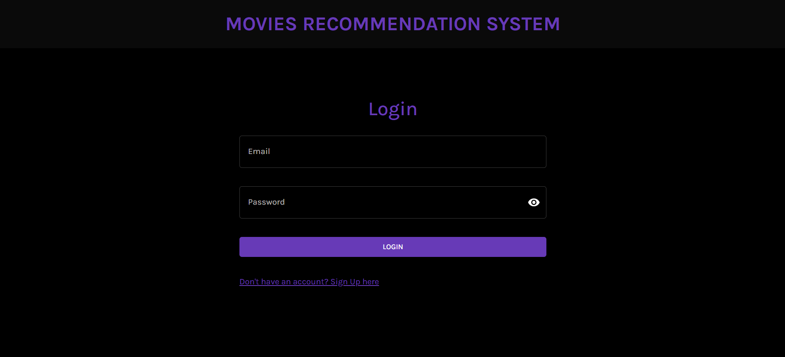
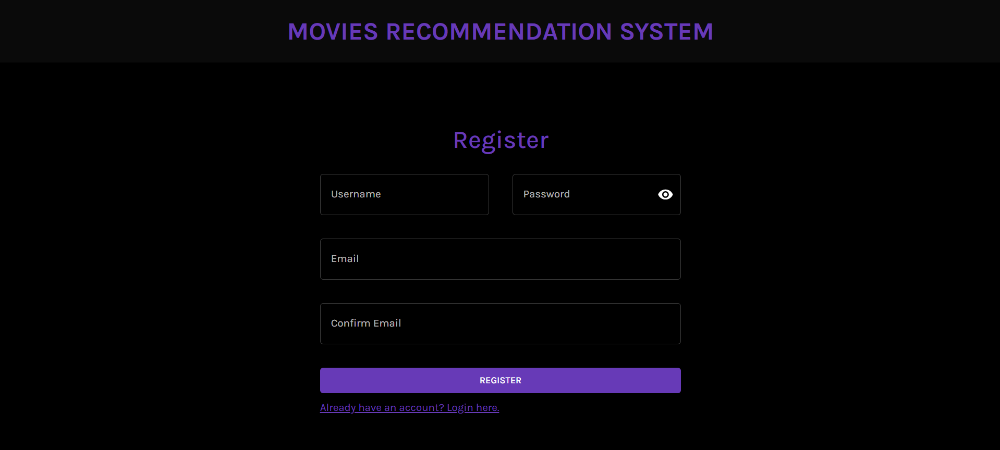
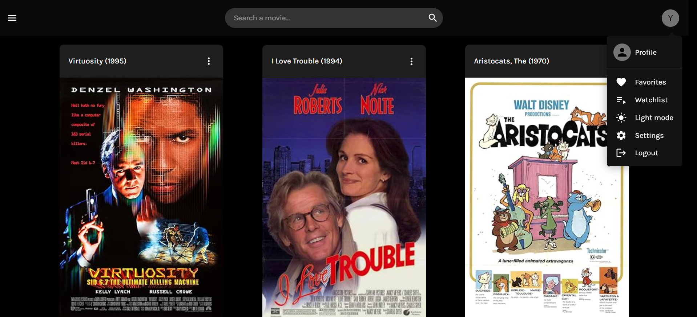

# Movie Recommendation System

## Overview

This project implements a movie recommendation system using collaborative filtering. The system provides personalized movie recommendations to users based on their past interactions with movies and the preferences of other users.

## Table of Contents

- [Overview](#overview)
- [Features](#features)
- [Technologies](#technologies)
- [Setup](#setup)
- [Usage](#usage)
- [ScreenShots](#ScreenShots)
- [License](#license)

## Features

- User authentication and management
- Movie database with ratings
- Personalized movie recommendations using collaborative filtering
- API endpoints for interacting with the recommendation system
- Responsive frontend with grid display of movie cards

## Technologies

- Python
- Django (Backend)
- Django REST Framework (API)
- Django Simple JWT (Authorization)
- Pandas (Data manipulation)
- React.js (Frontend)
- Tailwind CSS and Material UI (Frontend styling)

## Setup

### Prerequisites

- Python 3.9+
- Node.js
- npm (Node Package Manager)
- PostgreSQL 

### Backend Setup

1.  Clone the repository:

    ```sh
    git clone https://github.com/yourusername/recommendation-system.git
    cd recommendation-system/backend
    ```

2.  Create a virtual environment and activate it:

    ```sh
    python -m venv venv
    source venv\Scripts\activate
    ```

3.  Install the dependencies:

    ```sh
    pip install -r requirements.txt
    ```

4.  Set up the database:

    ```sh
    python manage.py migrate
    ```

5.  Create a superuser:

    ```sh
    python manage.py createsuperuser
    ```

6.  Run the development server:
    ```sh
    python manage.py runserver
    ```
### Frontend Setup
1. Navigate to frontend directory:

    ```sh
    cd ../frontend
    ```

2.  Install the dependencies:

    ```sh
    npm install
    ```

3.  Start the development server:
    ```sh
    npm run dev
    ```

## Usage

1. Open your browser and go to [http://localhost:3000](http://localhost:3000) to access the frontend.
2. Register or log in with your user credentials.
3. Browse movies and rate them.
4. Get personalized movie recommendations.


## ScreenShots




## License
MIT License

Copyright (c) [2024] [KHALSS Yassine]

Permission is hereby granted, free of charge, to any person obtaining a copy
of this software and associated documentation files (the "Software"), to deal
in the Software without restriction, including without limitation the rights
to use, copy, modify, merge, publish, distribute, sublicense, and/or sell
copies of the Software, and to permit persons to whom the Software is
furnished to do so, subject to the following conditions:

The above copyright notice and this permission notice shall be included in all
copies or substantial portions of the Software.

THE SOFTWARE IS PROVIDED "AS IS", WITHOUT WARRANTY OF ANY KIND, EXPRESS OR
IMPLIED, INCLUDING BUT NOT LIMITED TO THE WARRANTIES OF MERCHANTABILITY,
FITNESS FOR A PARTICULAR PURPOSE AND NONINFRINGEMENT. IN NO EVENT SHALL THE
AUTHORS OR COPYRIGHT HOLDERS BE LIABLE FOR ANY CLAIM, DAMAGES OR OTHER
LIABILITY, WHETHER IN AN ACTION OF CONTRACT, TORT OR OTHERWISE, ARISING FROM,
OUT OF OR IN CONNECTION WITH THE SOFTWARE OR THE USE OR OTHER DEALINGS IN THE
SOFTWARE.
